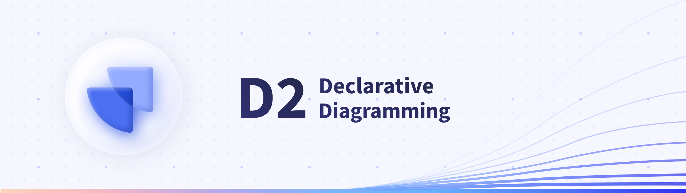
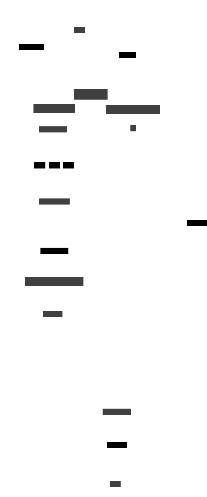

<div align="center">
  
  <h2>
    A modern diagram scripting language that turns text to diagrams.
  </h2>

[Docs](https://d2lang.com) | [Cheat sheet](./docs/assets/cheat_sheet.pdf) | [Comparisons](https://text-to-diagram.com) | [Playground](https://play.d2lang.com) | [IDE](https://app.terrastruct.com)

[](https://github.com/terrastruct/d2/actions/workflows/ci.yml)
[](https://github.com/terrastruct/d2/actions/workflows/daily.yml)
[](https://github.com/terrastruct/d2/releases)
[](./CHANGELOG.md)
[](https://www.npmjs.com/package/@terrastruct/d2)
[](https://discord.gg/NF6X8K4eDq)
[](https://twitter.com/terrastruct)
[](./LICENSE.txt)

<a href="https://play.d2lang.com">

</a>
<a href="https://app.terrastruct.com">

</a>

https://user-images.githubusercontent.com/3120367/206125010-bd1fea8e-248a-43e7-8f85-0bbfca0c6e2a.mp4

</div>

# Table of Contents

<!-- toc -->
- [What does D2 look like?](#what-does-d2-look-like)
- [Quickstart](#quickstart)
- [Install](#install)
- [D2 as a library](#d2-as-a-library)
- [Themes](#themes)
- [Fonts](#fonts)
- [Export file types](#export-file-types)
- [Language tooling](#language-tooling)
- [Plugins](#plugins)
- [Comparison](#comparison)
- [Contributing](#contributing)
- [License](#license)
- [Related](#related)
  - [Official plugins](#official-plugins)
  - [Community plugins](#community-plugins)
  - [Misc](#misc)
- [FAQ](#faq)
- [Notable open-source projects documenting with D2](#notable-open-source-projects-documenting-with-d2)

## What does D2 look like?

```d2
vars: {
  d2-config: {
    layout-engine: elk
    # Terminal theme code
    theme-id: 300
  }
}
network: {
  cell tower: {
    satellites: {
      shape: stored_data
      style.multiple: true
    }

    transmitter

    satellites -> transmitter: send
    satellites -> transmitter: send
    satellites -> transmitter: send
  }

  online portal: {
    ui: {shape: hexagon}
  }

  data processor: {
    storage: {
      shape: cylinder
      style.multiple: true
    }
  }

  cell tower.transmitter -> data processor.storage: phone logs
}

user: {
  shape: person
  width: 130
}

user -> network.cell tower: make call
user -> network.online portal.ui: access {
  style.stroke-dash: 3
}

api server -> network.online portal.ui: display
api server -> logs: persist
logs: {shape: page; style.multiple: true}

network.data processor -> api server
```

<p align="center">
    
</p>

> Open in [playground](https://play.d2lang.com/?script=rVLLTsQwDLznKyJxbrWwtyLxFdyR1Zg2ahpHibvLCvXfcdqGfSHthVv8yIxn7APE1OhvpbV5qVryn7ZbQ60dnGjiCn1nPTYa3bCkn_Q7xtF6cJp7HFG3ZHCpLGFlTaP3u51kZjUrj3ykOKyYLTr5REeMhSMBS84yppKRXA9B-BJTRPNhgKEU-OSwHifHNjjp4DitxLNa-SP4NFpmjOoGXVdvl2VBR2_-sWeZgLwTp3SgyOCKnsnKa5PU4xd05OfyIWvTIVKLKdHZExEOHd4Z0p4E3oi2h25s8Ge764uZs4Rr4vqXMfQkAhx1SVanplQWtU0QMCbyEh-t4b7Rz_td6cuo267ryzWPMMiFgHN3XVdu1dkmaPM8K-EiLnGkASsDScj2mQqCFcvj4RGUsSnI_d70Z2GrCptYrVHZTRADXv80VWgL0bVvGfJMoH4A)

> For more examples, see [./docs/examples](./docs/examples).

## Quickstart

The most convenient way to use D2 is to just run it as a CLI executable to
produce SVGs from `.d2` files.

```sh
# First, install D2
curl -fsSL https://d2lang.com/install.sh | sh -s --

echo 'x -> y -> z' > in.d2
d2 --watch in.d2 out.svg
```

A browser window will open with `out.svg` and live-reload on changes to `in.d2`.

## Install

The easiest way to install is with our install script:

```sh
curl -fsSL https://d2lang.com/install.sh | sh -s --
```

You can run the install script with `--dry-run` to see the commands that will be used
to install without executing them.

Or if you have Go installed you can install from source though you won't get the manpage:

```sh
go install oss.terrastruct.com/d2@latest
```

You can also install a release from source which will include manpages.
See [./docs/INSTALL.md#source-release](./docs/INSTALL.md#source-release).

To uninstall with the install script:

```sh
curl -fsSL https://d2lang.com/install.sh | sh -s -- --uninstall
```

For detailed installation docs, see [./docs/INSTALL.md](./docs/INSTALL.md).
We demonstrate alternative methods and examples for each OS.

As well, the functioning of the install script is described in detail to alleviate any
concern of its use. We recommend using your OS's package manager directly instead for
improved security but the install script is by no means insecure.

## D2 as a library

In addition to being a runnable CLI tool, D2 can also be used to produce diagrams from
Go programs.

For examples, see [./docs/examples/lib](./docs/examples/lib). This [blog
post](https://terrastruct.com/blog/post/generate-diagrams-programmatically/) also demos a
complete, runnable example of using D2 as a library for a real-world use case.

## Themes

D2 includes a variety of official themes to style your diagrams beautifully right out of
the box. See [./d2themes](./d2themes) to browse the available themes and make or
contribute your own creation.

## Fonts

D2 ships with "Source Sans Pro" as the font in renders. If you wish to use a different
one, please see [./d2renderers/d2fonts](./d2renderers/d2fonts).

## Export file types

D2 currently supports SVG, PNG and PDF exports. More coming soon.

## Language tooling

D2 is designed with language tooling in mind. D2's parser can parse multiple errors from a
broken program, has an autoformatter, syntax highlighting, and we have plans for LSP's and
more. Good language tooling is necessary for creating and maintaining large diagrams.

The extensions for VSCode and Vim can be found in the [Related](#related) section.

## Plugins

D2 is designed to be extensible and composable. The plugin system allows you to
change out layout engines and customize the rendering pipeline. Plugins can either be
bundled with the build or separately installed as a standalone binary.

**Layout engines**:

- [dagre](https://github.com/dagrejs/dagre) (default, bundled): A fast, directed graph
  layout engine that produces layered/hierarchical layouts. Based on Graphviz's DOT
  algorithm.
- [ELK](https://github.com/kieler/elkjs) (bundled): A directed graph layout engine
  particularly suited for node-link diagrams with an inherent direction and ports.
- [TALA](https://github.com/terrastruct/TALA) (binary): Novel layout engine designed
  specifically for software architecture diagrams. Requires separate install, visit the
  Github page for more.

D2 intends to integrate with a variety of layout engines, e.g. `dot`, as well as
single-purpose layout types like sequence diagrams. You can choose whichever layout engine
you like and works best for the diagram you're making.

## Comparison

For a comparison against other popular text-to-diagram tools, see
[https://text-to-diagram.com](https://text-to-diagram.com).

## Contributing

Contributions are welcome! See [./docs/CONTRIBUTING.md](./docs/CONTRIBUTING.md).

## License

Open sourced under the Mozilla Public License 2.0. See [./LICENSE.txt](./LICENSE.txt).

## Related

We are constantly working on new plugins, integrations, extensions. Contributions are
welcome in any official or community plugins. If you have somewhere in your workflow that
you want to use D2, feel free to open a discussion. We have limited bandwidth and usually
choose the most high-demand ones to work on. If you make something cool with D2 yourself,
let us know and we'll be happy to include it here!

### Official plugins

- **VSCode extension**: [https://github.com/terrastruct/d2-vscode](https://github.com/terrastruct/d2-vscode)
- **Vim extension**: [https://github.com/terrastruct/d2-vim](https://github.com/terrastruct/d2-vim)
- **Obsidian plugin**: [https://github.com/terrastruct/d2-obsidian](https://github.com/terrastruct/d2-obsidian)
- **Slack app**: [https://d2lang.com/tour/slack](https://d2lang.com/tour/slack)
- **Discord plugin**: [https://d2lang.com/tour/discord](https://d2lang.com/tour/discord)

### Community plugins

- **Tree-sitter grammar**: [https://github.com/ravsii/tree-sitter-d2](https://github.com/ravsii/tree-sitter-d2)
- **Emacs major mode**: [https://github.com/andorsk/d2-mode](https://github.com/andorsk/d2-mode)
- **Goldmark extension**: [https://github.com/FurqanSoftware/goldmark-d2](https://github.com/FurqanSoftware/goldmark-d2)
- **Telegram bot**: [https://github.com/meinside/telegram-d2-bot](https://github.com/meinside/telegram-d2-bot)
- **Postgres importer**: [https://github.com/zekenie/d2-erd-from-postgres](https://github.com/zekenie/d2-erd-from-postgres)
- **Structurizr to D2 exporter**: [https://github.com/goto1134/structurizr-d2-exporter](https://github.com/goto1134/structurizr-d2-exporter)
- **MdBook preprocessor**: [https://github.com/danieleades/mdbook-d2](https://github.com/danieleades/mdbook-d2)
- **ROS2 D2 Exporter**: [https://github.com/Greenroom-Robotics/ros-d2](https://github.com/Greenroom-Robotics/ros-d2)
- **D2 org-mode support**: [https://github.com/xcapaldi/ob-d2](https://github.com/xcapaldi/ob-d2)
- **Python D2 diagram builder**: [https://github.com/MrBlenny/py-d2](https://github.com/MrBlenny/py-d2)
- **Clojure D2 transpiler**: [https://github.com/judepayne/dictim](https://github.com/judepayne/dictim)
- **JavaScript D2 diagram builder**: [https://github.com/Kreshnik/d2lang-js](https://github.com/Kreshnik/d2lang-js)
- **C# & dotnet SDK**: [https://github.com/Stephanvs/d2lang-cs](https://github.com/Stephanvs/d2lang-cs)
- **Maven plugin**: [https://github.com/andrinmeier/unofficial-d2lang-maven-plugin](https://github.com/andrinmeier/unofficial-d2lang-maven-plugin)
- **Confluence plugin**: [https://github.com/andrinmeier/unofficial-d2lang-confluence-plugin](https://github.com/andrinmeier/unofficial-d2lang-confluence-plugin)
- **CIL (C#, Visual Basic, F#, C++ CLR) to D2**: [https://github.com/HugoVG/AppDiagram](https://github.com/HugoVG/AppDiagram)
- **D2 Snippets (for text editors)**: [https://github.com/Paracelsus-Rose/D2-Language-Code-Snippets](https://github.com/Paracelsus-Rose/D2-Language-Code-Snippets)
- **Mongo to D2**: [https://github.com/novuhq/mongo-to-D2](https://github.com/novuhq/mongo-to-D2)
- **Pandoc filter (TypeScript)**: [https://github.com/ram02z/d2-filter](https://github.com/ram02z/d2-filter)
- **Pandoc filter (Python)**: [https://github.com/fliiiix/pandoc-d2-filter](https://github.com/fliiiix/pandoc-d2-filter)
- **Logseq-D2**: [https://github.com/b-yp/logseq-d2](https://github.com/b-yp/logseq-d2)
- **ent2d2**: [https://github.com/tmc/ent2d2](https://github.com/tmc/ent2d2)
- **MkDocs Plugin**: [https://github.com/landmaj/mkdocs-d2-plugin](https://github.com/landmaj/mkdocs-d2-plugin)
- **Remark Plugin**: [https://github.com/mech-a/remark-d2](https://github.com/mech-a/remark-d2)
- **VitePress Plugin**: [https://github.com/BadgerHobbs/vitepress-plugin-d2](https://github.com/BadgerHobbs/vitepress-plugin-d2)
- **Zed extension**: [https://github.com/gabeidx/zed-d2](https://github.com/gabeidx/zed-d2)
- **Hexo blog extension**: [https://github.com/leverimmy/hexo-d2](https://github.com/leverimmy/hexo-d2)
- **Rehype Plugin**: [https://github.com/stereobooster/beoe/tree/main/packages/rehype-d2](https://github.com/stereobooster/beoe/tree/main/packages/rehype-d2)
- **AsyncAPI to D2**: [https://github.com/holydocs/messageflow](https://github.com/holydocs/messageflow)
- **Database Schemas to D2**: [https://github.com/holydocs/dberd](https://github.com/holydocs/dberd)

### Misc

- **Comparison site**: [https://github.com/terrastruct/text-to-diagram-site](https://github.com/terrastruct/text-to-diagram-site)
- **Playground**: [https://github.com/terrastruct/d2-playground](https://github.com/terrastruct/d2-playground)
- **IDE (paid)**: [https://app.terrastruct.com](https://app.terrastruct.com)
- **Language docs**: [https://github.com/terrastruct/d2-docs](https://github.com/terrastruct/d2-docs)
- **Hosted icons**: [https://icons.terrastruct.com](https://icons.terrastruct.com)

## FAQ

- Does D2 collect telemetry?
  - No, D2 does not use an internet connection after installation, except to check for
    version updates from Github periodically.
- Does D2 need a browser to run?
  - No, D2 can run entirely server-side.
- What's coming in the next release?
  - See [./ci/release/changelogs/next.md](./ci/release/changelogs/next.md).
- I have a question or need help.
  - The best way to get help is to ask on [D2 Discord](https://discord.gg/NF6X8K4eDq)
- I have a feature request, proposal, or bug report.
  - Please open up a Github Issue.
- I have a private inquiry.
  - Please reach out at [hi@d2lang.com](hi@d2lang.com).

## Notable open-source projects documenting with D2

Do you have or see an open-source project with `.d2` files? Please submit a PR adding to
this selected list of featured projects using D2.

- [ElasticSearch](https://github.com/elastic/beats/blob/main/libbeat/publisher/queue/proxy/diagrams/broker.d2)
- [Sourcegraph](https://handbook.sourcegraph.com/departments/engineering/managed-services/telemetry-gateway/#dev-architecture-diagram)
- [Temporal](https://github.com/temporalio/temporal/blob/0be2681c994470c7c61ea88e4fcef89bb4024e58/docs/_assets/matching-context.d2)
- [Tauri](https://v2.tauri.app/concept/inter-process-communication/)
    - Rust GUI framework (78.5k stars)
- [Intellij](https://github.com/JetBrains/intellij-community/blob/45bcfc17a3f3e0d8548bc69e922d4ca97ac21b2b/platform/settings/docs/topics/overview.md)
- [Coder](https://coder.com/blog/managing-templates-in-coder)
- [UC
  Berkeley](https://github.com/ucb-bar/hammer/blob/2b5c04d7b7d9ee3c73575efcd7ee0698bd5bfa88/doc/Hammer-Use/hier.d2)
- [Coronacheck](https://github.com/minvws/nl-covid19-coronacheck-app-ios/blob/e1567e9d1633b3273c537a105bff0e7d3a57ecfe/Diagrams/client-side-datamodel.d2)
  - Official app of the Netherlands for coronavirus entry passes.
- [Block
  Protocol](https://github.com/blockprotocol/blockprotocol/blob/db4cf8d422b881e52113aa52467d53115270e2b3/libs/%40blockprotocol/type-system/crate/assets/overview.d2)
  - The Block Protocol is an open standard for building and using data-driven blocks (1.2k
    stars).
- [Dagger](https://github.com/dagger/dagger/tree/main/cmd/dagger-graph)
  - A programmable CI/CD engine that runs your pipelines in containers (8k stars).
- [Ivy
  Wallet](https://github.com/Ivy-Apps/ivy-wallet/blob/8062624bfa65175ec143cdc4038de27a84d38b57/assets/calc_algo.d2)
  - Open-source money manager app for Android (1.1k stars).
- [LocalStack](https://docs.localstack.cloud/references/network-troubleshooting/)
  - Cloud service emulator (46k stars)
- [Queue Library](https://github.com/golang-queue/queue/tree/master/images)
  - Queue is a Golang library for spawning and managing a Goroutine pool
