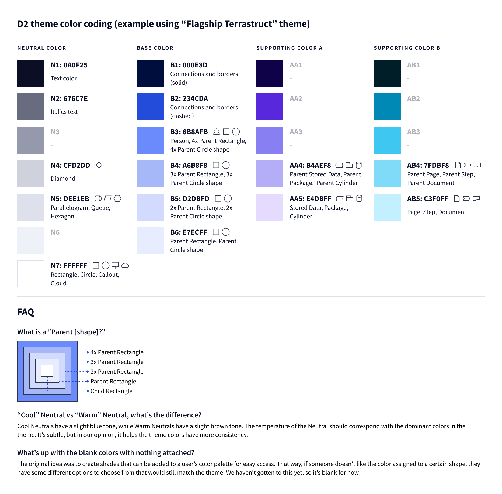
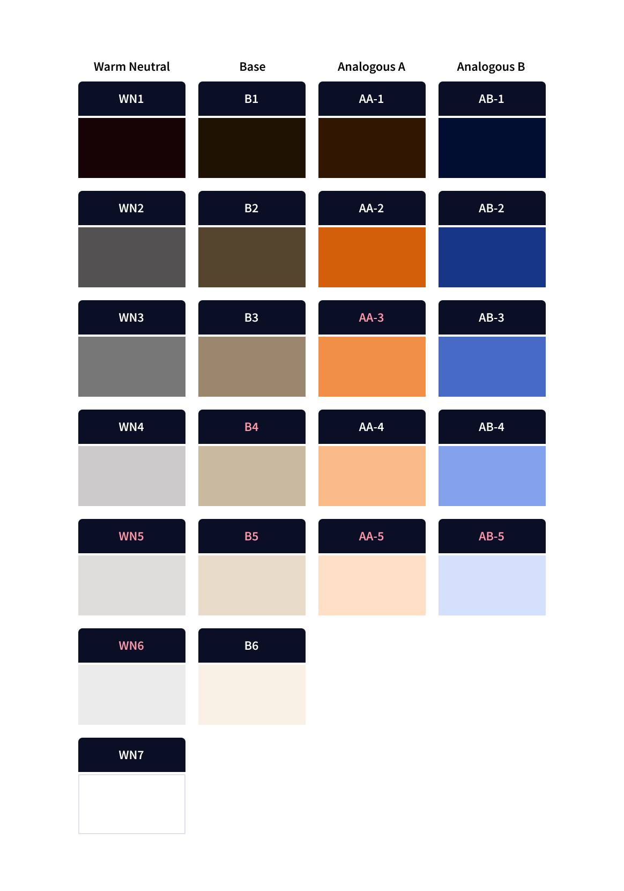

# d2themes

`d2themes` defines themes for D2. You can add a new one in `./d2themescatalog`, give a
unique ID, and specify it in the CLI or library to see it.

# Color coding guide

# Color coding example

# Container gradients

To distinguish container nesting, objects get progressively lighter the more nested it is.

