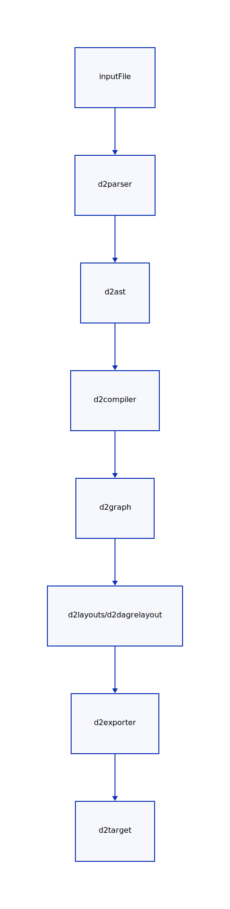

# Contributing

<!-- toc -->

- [CI](#ci)
- [Flow](#flow)
- [Logistics](#logistics)
- [Dev](#dev)
  * [Content](#content)
  * [Tests](#tests)
    + [Running tests](#running-tests)
    + [Chaos tests](#chaos-tests)
  * [Documentation](#documentation)
  * [Questions](#questions)

<!-- tocstop -->

## CI

Most of D2's CI is open sourced in its own
[repository](https://github.com/terrastruct/ci). You can find commands in the Github
workflows. E.g. run `./make.sh fmt` to run the formatter. Please make sure all CI is
passing for any PRs.

## Flow

The simplified D2 flow at a package level looks like:



## Logistics

- **Important**: Contributions to D2 require a CLA. We will never relicense D2, but we
  need to retain full copyright for any modifications we might need to make in our
  commercial offerings. Please email cla@terrastruct.com with your name and Github
  username stating that you agree to [Terrastruct's
  CLA](https://terrastruct-site-assets.s3.us-west-1.amazonaws.com/documents/terrastruct_cla.pdf).
  You only have to do this the first time you contribute.
- D2 uses Issues as TODOs. No auto-closing on staleness.
- Branch off `master`.
- Prefix pull request titles with a short descriptor of the domain, e.g. `d2renderer: Add
  x`.
- If there's an Issue related, include it by adding "[one-word] #[issue]", e.g. "Fixes
  #123" somewhere in the description.
- Whenever possible and relevant, include a screenshot or screen-recording.

## Dev

### Content

Please choose an Issue with a "TODO" label. If you'd like to propose new functionality or
change to current functionality, please create an Issue first with a proposal. When you
start work on an Issue, please leave a comment so others know that it's being worked on.

### Tests

All code changes must include tests. D2 mostly has functional tests (see `e2etests` directory), and uses
[diff](https://github.com/terrastruct/diff) as a framework that gives Git-style
comparisons of expected vs actual output for each stage. There are ample examples in each
package of this -- try changing some test and run it to see.

With the exception of changes to the renderer, all code should include a package-specific
test. If it's a visual change, an e2e test should accompany.

If you're testing labels and strings, it's encouraged to use 1-letter strings (`x`) in small
functional tests to minimally pinpoint issues. If you are testing something that exercises
variations in strings, or want to mimic more realistic diagram text, it's encouraged you
generate random strings and words from `fortune`. It gives a good range of the English
language. Sometimes it gives controversial sentences -- don't use those.

Script to generate one line of random text:
```
ipsum1() {
  fortune | head -n1 | sed 's/^ *//;s/ *$//' | tr -d '\n' | tee /dev/stderr | pbcopy
}
```

#### Running tests

Run: `./ci/test.sh`

CI runs tests with `-race` to catch potential race conditions. It's much slower, but if
your machine can run it locally, you can do so with `./make.sh race`.

If you had to change/add functional test cases (under `e2etests` directory), make sure
you updated them before opening a PR.

Run: `TESTDATA_ACCEPT=1 ./ci/test.sh` or `TA=1 ./ci/test.sh` for a shorter version.

#### Chaos tests

D2 has [chaos tests](https://en.wikipedia.org/wiki/Chaos_engineering) which produce random
configurations of diagrams. It can be helpful to run a few iterations (N~=100) to spot
cover your manual tests.

`D2_CHAOS_MAXI=100 D2_CHAOS_N=100 ./ci/test.sh ./d2chaos`

### Documentation

The code itself should be documented as appropriate with Go-style comments. No rules here,
`GetX()` doesn't need a `// GetX gets X`.

If it's some new functionality, please submit a pull request to document it in the
language docs:
[https://github.com/terrastruct/d2-docs](https://github.com/terrastruct/d2-docs).

### Questions

If you have any questions or would like to get more involved, feel free to open an issue
to discuss publicly, or chat in [Discord](https://discord.gg/NF6X8K4eDq)! If you have a
private inquiry, feel free to email us at hi@d2lang.com.
