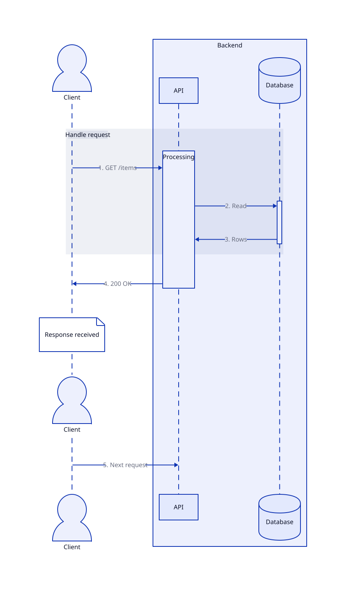

# Sequence diagrams v2

Use `shape: sequence-diagram` to select the new sequence diagram layout. Existing
diagrams with `shape: sequence_diagram` continue to use the original layout and
syntax.

Actors appear across the top, and messages and actor events follow their source
order down the diagram. Actors do not need to be declared before messages refer
to them. Declare actors first when you want to choose their order or appearance.

## Example

[Runnable example](examples/sequence-v2/diagram.d2) and its rendered output:



The following example also demonstrates an event and messages that share a row.
Save it as `sequence.d2` and run `d2 sequence.d2 sequence.svg`:

```d2
shape: sequence-diagram
grid-gap: 40
horizontal-gap: 120
vertical-gap: 56
vars: {
  mirror: true
  numbered: true
}

client: Client {shape: person}
service: Service {
  shape: actor-group
  api: API
  db: Database {shape: cylinder}
}

request: Request {
  shape: edge-group
  client -> service.api.work: GET /items {vertical-gap: 0}
  service.api.work -> service.db: Read items
  service.db -> service.api.work: Items
}
service.api.work: Query {label.near: top-left}
service.api.work -> client: 200 OK

client.note: Response received {shape: page}
client.done: Complete {shape: diamond}
client.again: {shape: actor}
client -> service.api: Next request
```

`service` groups two actors. `request` groups messages and may introduce actors
or spans through its connections. `service.api.work` is a labeled activation
span. The note and diamond are events on the client's timeline. `client.again`
repeats the client actor partway down, and `mirror` repeats actors at the bottom.

## Actors and actor groups

A top-level object is an actor unless it has `shape: actor-group` or
`shape: edge-group`. Actors can use ordinary labels, shapes, and styles.

An actor group uses an ordinary D2 container with `shape: actor-group`. Refer to
its members with qualified names, such as `service.api` and `service.db`. Actor
groups collect participants under a shared label; they do not create separate
timelines. Use `shape: actor-group` for nested actor groups as well.

## Message groups

Use `shape: edge-group` to put a box and label around a sequence of messages:

```d2
shape: sequence-diagram
handshake: {
  shape: edge-group
  alice -> bob: Hello
  bob -> alice: Welcome
}
```

This creates the actors `alice` and `bob` without separate declarations. Message
groups do not add a namespace to their message endpoints. Groups can nest; mark
each nested message group with `shape: edge-group` too.

Indexed message overrides still use the group that defines the message. For
example, `handshake.(alice -> bob)[0].style.stroke: blue` styles the first message
in `handshake`. Inside that group, use `(alice -> bob)[0].style.stroke: blue`.

## Spans, notes, and events

An actor's descendants have an explicit role:

| Declaration | Role |
| --- | --- |
| No `shape` | Activation span; messages can attach to it |
| `shape: page` | Note on the actor's timeline |
| `shape: actor` | Repeat of the containing actor |
| Another ordinary shape | Event on the actor's timeline |

Actors with `shape: class` or `shape: sql_table` retain their ordinary member or
column syntax. Give a child an explicit shape to create a timeline item instead.

Spans can nest, such as `api.request.query`. A span's identifier is hidden by
default. Assign a label to show it, and use `label.near` to position it:

```d2
shape: sequence-diagram
client -> api.request
api.request: Handling request {label.near: top-left}
api.request -> client: Done
```

Messages connect actors or spans. A note, event, or actor repeat cannot be a
message endpoint; connect to its actor instead.

## Spacing

Set spacing on the sequence diagram:

- `horizontal-gap` controls the space between actors.
- `vertical-gap` controls the space between successive messages and events.
- `grid-gap` supplies a common gap; directional settings override it.

Set `vertical-gap` on a message to change the spacing **after** that message.
A value of `0` lets the next message share its vertical position:

```d2
shape: sequence-diagram
a -> b: First {vertical-gap: 0}
b -> c: Second
```

Choose enough spacing for your labels and events. Connections written as a chain
still advance through the sequence; use an explicit message gap when they should
share a row.

## Repeating actors and numbering messages

Set `mirror: true` in the sequence diagram's `vars` map to repeat actors at the bottom.
To repeat one actor midway, declare a child with `shape: actor` where that repeat
belongs in the source:

```d2
shape: sequence-diagram
alice -> bob: First exchange
alice.reminder: {shape: actor}
bob.reminder: {shape: actor}
alice -> bob: Later exchange
```

Set `numbered: true` in the same map to prefix messages with consecutive numbers
in sequence order. These options default to `false`:

```d2
shape: sequence-diagram
vars: {
  mirror: true
  numbered: true
}
alice -> bob: Hello
```

## Migrating an existing diagram

Keep `shape: sequence_diagram` to retain the original behavior. To opt into v2,
change the shape spelling and mark message groups explicitly. For example, this
original diagram:

```d2
shape: sequence_diagram
alice
bob
conversation: {
  alice -> bob: Hello
  bob -> alice: Welcome
}
```

becomes:

```d2
shape: sequence-diagram
conversation: {
  shape: edge-group
  alice -> bob: Hello
  bob -> alice: Welcome
}
```

Actor declarations remain useful for ordering and styling, but message groups
no longer require them. Mark notes with `shape: page`; an actor child without a
shape is a span. Explicit span labels now appear, so remove a span's label if it
should remain hidden. Use `shape: actor-group` when a container represents a
group of participants rather than an activation span.
